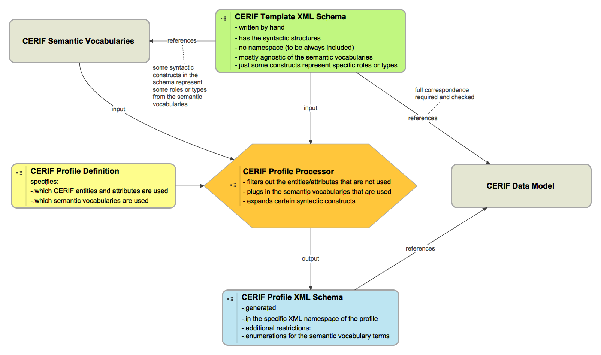

# CERIF-Labs
An experiment with updating the CERIF XML exchange format.

CERIF stands for the Common European Research Information Format. It is maintained by [euroCRIS](http://eurocris.org).

Here a brief outline of the workflow we want to support:

The present take on the CERIF Template XML Schema is [here](template.xsd).